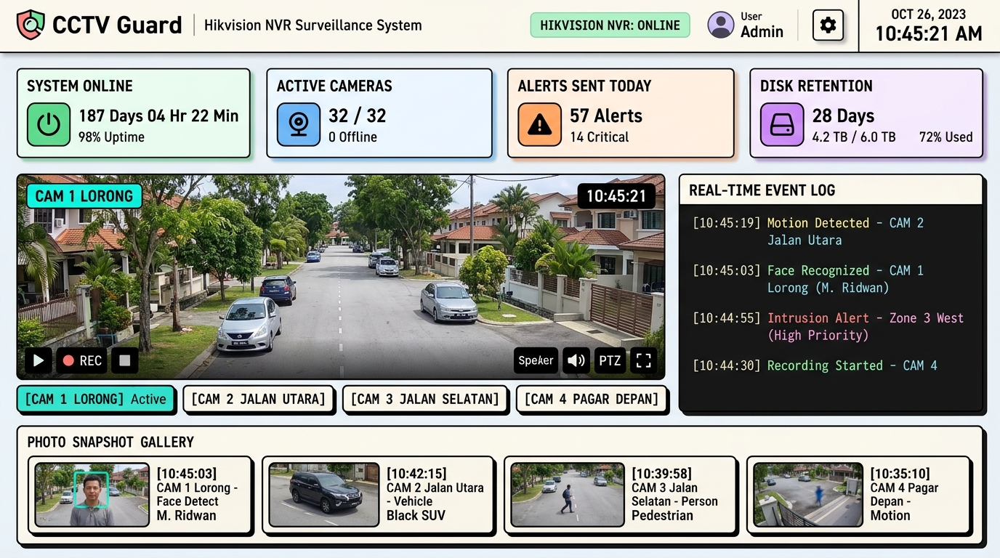
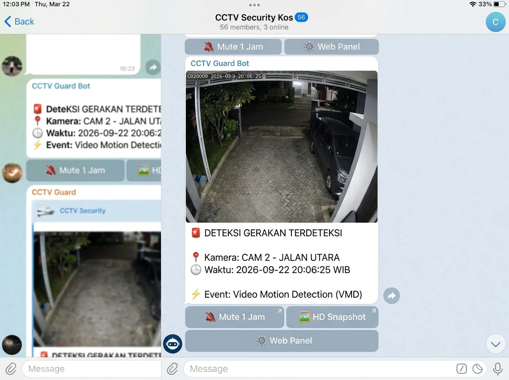

# 🛡️ CCTV Guard & Telegram Alert System (Multi-Camera NVR Hub)

[](https://www.python.org/)
[](https://opensource.org/licenses/MIT)
[]()
[]()

Sebuah microservice mandiri berbasis Python 3 untuk memantau kamera IP dan NVR Hikvision secara realtime, menangkap snapshot resolusi tinggi (Main-Stream 1080p) saat mendeteksi gerakan manusia/VMD (*Video Motion Detection*), mengirimkan peringatan otomatis ke Telegram, serta menyediakan **Web Panel Dashboard Monitor interaktif** bergaya **Retro Light (Soft Neo-Brutalism)**.

---

## 📸 Screenshots & Antarmuka

### 🖥️ 1. Web Panel Dashboard Monitor (Retro Light Neo-Brutalism)


### 📲 2. Notifikasi Alert Deteksi Gerakan di Telegram


---

## 🌟 Fitur Utama

- ⚡ **Zero-Latency Event Stream Listener**: Membuka persistent connection HTTP Digest ke Hikvision ISAPI `alertStream` NVR dengan kemampuan *auto-reconnect* tanpa henti.
- 🎛️ **Multi-Camera NVR Hub**: Memantau seluruh channel kamera (Ch 1 s/d Ch 16+) secara simultan melalui satu koneksi NVR terpusat.
- 🔄 **1-Click Auto-Discovery & NVR Sync**: Otomatis mendeteksi dan menyinkronkan seluruh daftar kamera, nama asli, dan IP target langsung dari NVR Hikvision.
- 🛡️ **Smart Independent Cooldown (Anti-Spam)**: Menyaring lonjakan deteksi agar tidak membombardir grup Telegram (5–180 detik, dihitung independen per channel).
- 📷 **High-Resolution Snapshot Dispatcher**: Mengambil frame 1080p realtime dari kamera/NVR dan mengirimkannya ke Telegram Bot API (`sendPhoto`) lengkap dengan caption HTML berstruktur rapi (WIB timestamp, lokasi, channel).
- 🔴 **Live MJPEG Video Streaming (~8 FPS)**: Endpoint `/api/live-stream` menyajikan sub-stream kamera langsung ke browser tanpa plugin atau WebRTC dengan fitur *Smart Auto-Pause* saat tab tidak aktif.
- 🗄️ **Manajemen Retensi Galeri**: Auto-cleanup snapshot lokal berdasarkan hari (`retention_days`) dan kuota file (`max_gallery_items`) setiap 30 menit.
- 🔐 **Web Panel Neo-Brutalism & PIN Security**: Antarmuka web retro responsif yang dikunci dengan PIN Numpad 6-digit.

---

## 🏗️ Diagram Arsitektur

```text
[ IP Cameras 1..N ] ──(RTSP/ISAPI)──> [ Hikvision NVR (Central) ]
                                              │
                                              ├──(ISAPI alertStream)
                                              ▼
                             ┌─────────────────────────────────┐
                             │  CCTV Guard Python Microservice │
                             │  (Threading HTTP Server :8088)  │
                             └─────────────────────────────────┘
                                              │
                   ┌──────────────────────────┴──────────────────────────┐
                   ▼                                                     ▼
      [ Smart Cooldown & Filter ]                           [ Web Panel Monitor ]
                   │                                        (Dashboard, Live MJPEG,
                   ├──(Pass Cooldown)                        Gallery, Logs, Settings)
                   ▼
      [ Capture 1080p Snapshot ]
                   │
         ┌─────────┴─────────┐
         ▼                   ▼
[ Local Disk Storage ]   [ Telegram Bot API ]
(/opt/.../snapshots/)    (Grup / Chat Alert)
```

---

## 🚀 Panduan Instalasi & Deployment

### ⚡ Cara 1: One-Line Quick Auto-Installer (Sangat Direkomendasikan)
Cukup jalankan satu baris perintah berikut di terminal server Linux Anda (Ubuntu / Debian / AlmaLinux / Rocky / CentOS):

```bash
curl -sSL https://raw.githubusercontent.com/mrburgercheese/hikvision-telegram-guard/main/install.sh | sudo bash
```

> **Catatan:** Script installer otomatis memeriksa sistem operasi, memasang dependensi (`curl`, `python3`, `requests`), menata folder kerja, menanyakan parameter konfigurasi, dan langsung mengaktifkan systemd service background.

---

### 🛠️ Cara 2: Instalasi Manual (Step-by-Step)

#### 1. Prasyarat Sistem
- Linux (Ubuntu 20.04+, Debian 11+, AlmaLinux/Rocky Linux 8+)
- Python 3.8 atau lebih baru
- Akses jaringan ke NVR / IP Kamera Hikvision

#### 2. Kloning Repositori
```bash
git clone https://github.com/mrburgercheese/hikvision-telegram-guard.git /opt/cctv-tg-guard
cd /opt/cctv-tg-guard
```

#### 3. Instalasi Dependensi
```bash
pip install -r requirements.txt
# atau via apt di Ubuntu/Debian:
apt-get install -y python3-requests
```

#### 4. Konfigurasi Awal
```bash
cp config.sample.json config.json
nano config.json
```
Sesuaikan parameter IP NVR, kredensial admin, Token Bot Telegram, Chat ID, dan PIN akses Web.

#### 5. Pasang & Jalankan Systemd Service
```bash
cp cctv-tg-guard.service /etc/systemd/system/cctv-tg-guard.service
systemctl daemon-reload
systemctl enable --now cctv-tg-guard.service

# Verifikasi status berjalan
systemctl status cctv-tg-guard.service
```

---

## 🌐 Penggunaan Web Panel Dashboard

Buka browser dan akses alamat IP server:
```
http://<IP_SERVER>:8088/
```
- **Default PIN Masuk**: `060708` *(dapat diubah di menu Pengaturan)*

### Navigasi Tab:
1. **📊 Dashboard**: Bento grid statistik realtime, multi-camera switcher, live video streaming MJPEG, dan tombol uji kirim Telegram.
2. **📜 Live Logs**: Terminal log color-coded (`TRIGGER`, `DELIVERED`, `COOLDOWN`, `ERROR`).
3. **🖼️ Galeri Event**: Galeri snapshot dengan filter multi-kamera & tanggal, modal preview HD, tombol unduh, dan pembersihan kadaluarsa.
4. **⚙️ Pengaturan**: Pengaturan visual NVR, Token Telegram, slider jeda anti-spam, tombol *Auto-Sync dari NVR*, dan toggle notifikasi per channel.
5. **📘 Panduan**: Diagram alir sistem dan FAQ teknis.

---

## 📄 Struktur Berkas
```
cctv-tg-guard/
├── cctv_it_guard.py        # Microservice utama (Backend + Web Server + Frontend)
├── cctv-tg-guard.service   # Systemd unit file untuk background daemon
├── config.sample.json      # Contoh berkas konfigurasi
├── requirements.txt        # Dependensi modul Python
├── .gitignore              # Proteksi berkas sensitif dan snapshot lokal
└── README.md               # Dokumentasi teknis proyek
```

---

## 🛡️ Keamanan & Lisensi
- File `config.json` dan folder `snapshots/` dilindungi di `.gitignore` untuk mencegah kebocoran kredensial atau foto privat ke repositori publik.
- Didistribusikan di bawah lisensi [MIT](LICENSE). Dikembangkan oleh **Hosterbyte Automation Team**.
